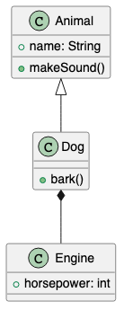

<p align="center">
  
</p>

# PlantUML Anywhere

**Install it and your PlantUML diagrams just work — no Java, no Graphviz, no server. Runs in github.dev too.**

Open a `.puml` / `.plantuml` file, run one command, and get a live preview of your class diagrams, sequence diagrams, and more, right inside a VS Code webview. No runtime to install, no network calls, nothing leaves your machine.



*(an actual diagram rendered by the extension)*

**Want to try it right now?** Copy-paste instructions for desktop VS Code, browser-based VS Code, and the standalone Chrome/Brave extension are in [`TRYING-IT.md`](TRYING-IT.md).

## Status

Verified working on desktop VS Code and in a local browser-based VS Code session. Not yet verified on live github.dev/vscode.dev, since sideloading isn't possible there and it requires a Marketplace listing (not published yet).

## How it works

Most PlantUML extensions render by shelling out to Java + Graphviz, or by sending your diagram source to a remote server. Neither works in a VS Code **Web Extension** (the kind that runs inside vscode.dev / github.dev), since browsers can't spawn subprocesses.

PlantUML Anywhere renders everything in the browser instead, using [`@plantuml/core`](https://www.npmjs.com/package/@plantuml/core), the PlantUML engine compiled to JavaScript via TeaVM, with its layout engine (Graphviz) compiled to WebAssembly (MIT licensed). Your diagram source never leaves your machine.

- Ships as a **Web Extension**, so it runs the same way on desktop VS Code and in the browser (vscode.dev / github.dev) — no separate builds needed.
- **1.94 MB** compressed.
- Don't need VS Code? The same rendering engine also powers a **standalone Chrome/Brave extension** (`browser-extension/`): open a local `.puml` file directly (`file://`) and it renders in place.

## Usage

1. Open a `.puml` or `.plantuml` file
2. Run `PlantUML: Preview` from the command palette (`Cmd/Ctrl+Shift+P`)
3. The rendered diagram opens in a webview next to your editor

## Build from source

```sh
npm install
npm run build
```

Open this repo in VS Code and press F5 to launch a debug instance, or run it as a browser-based VS Code session with `@vscode/test-web`:

```sh
npx @vscode/test-web --extensionDevelopmentPath=. --esm <folder>
```

To package and install a local `.vsix`:

```sh
npx @vscode/vsce package
code --install-extension plantuml-anywhere-0.3.0.vsix
```

## Design

The domain (`src/domain`) and application (`src/application`) layers follow clean architecture and depend on neither the VS Code API nor `@plantuml/core`. See [`docs/design/architecture.md`](docs/design/architecture.md) for the full layer breakdown.

WASM rendering happens inside the webview (which has a real DOM) and talks to the extension host over `postMessage`. See [`docs/design/step2-vscode-extension-design.md`](docs/design/step2-vscode-extension-design.md) for the reasoning behind that split.

## Known limitations

- **`!include` (local files)**: supported in the VS Code extension for relative paths (nested includes work too). Not supported in the Chrome/Brave extension, or for absolute paths, URLs, or bundled-library references (`!include <awslib/...>`) — referencing those shows a clear "cannot include ..." error in the diagram instead of hanging.
- **No bundled sprite libraries**: heavyweight icon sets (AWS, Material, tupadr3, ...) aren't included; using them shows a parsing error instead of rendering.
- **No export, snippets, localization, or multi-page diagrams.** The scope is "open a file, see the preview."
- **No live reload**: the diagram renders once, when you run the command; it doesn't auto-update as you type.

## License

MIT. This project depends on `@plantuml/core`, which is MIT-licensed from v1.2026.6 onward (earlier versions are GPL-3.0-or-later) — this repo is pinned to `1.2026.6`.
