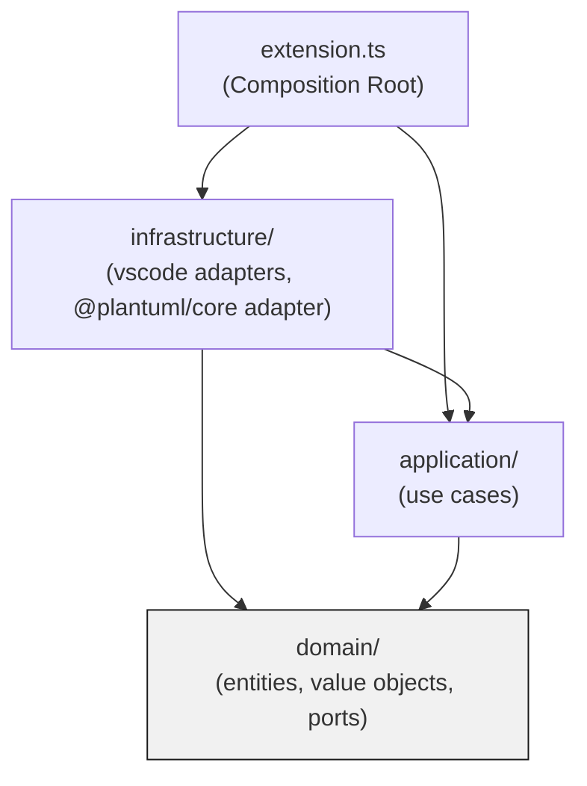

# アーキテクチャ設計(レイヤー構成と依存方向)

## 目的

このドキュメントは plantuml-anywhere のレイヤー構成と、レイヤー間で許可される依存方向を定義する。
実装はここから逸脱しない。逸脱が必要になった場合は実装を止めて本ドキュメントを更新し、
司令塔の再レビューを受ける。

## 配布ターゲット

1. **VS Code拡張機能**: Web版(vscode.dev/github.dev等、ブラウザ上で動くVS Code)と
   デスクトップ版VS Codeの両対応。`package.json` の `browser` エントリのみで両対応する
   (デスクトップ版でも自動的にWeb Worker拡張ホストが作られて動作することを実機検証済み。
   `docs/design/vsix-install-verification.md` 参照)。`.puml` を開くとWebviewにプレビューが
   出る、という挙動。
2. **Chrome/Brave拡張機能**(単体、VS Code非依存): `browser-extension/` に実装。ローカルの
   `.puml`/`.plantuml` ファイルを `file://` で直接開いたときに、その場でプレビュー表示する。

   一度(2026-08-20)スコープ外・不採用としたが、2026-08-21 オーナー指示によりスコープ復活
   (「Brave版を他のマシンからインストールできるようにしてほしい」)。VS Code拡張機能の
   優先度が下がるわけではない。詳細な設計・実装は `docs/design/browser-extension-design.md`、
   `docs/design/browser-extension-v2-lazy-loading.md` を参照。

両ターゲットは `src/domain/` `src/application/`(純粋ロジック)を共有し、
`src/infrastructure/rendering/`(`PlantUmlCoreRenderer`)も共有する。ターゲット固有なのは
`src/infrastructure/vscode/` `src/infrastructure/browser-extension/` とエントリポイント
(`src/extension.ts` / `src/browser-extension-renderer/index.ts`)のみ。

## レイヤー構成(VS Code拡張機能ターゲット)

```
src/
  domain/         ← 最も内側。フレームワーク・vscode API・DOM に一切依存しない
  application/     ← ユースケース。domain のポート(interface)にのみ依存する
  infrastructure/  ← domain/application が定義したポートの実装。vscode API・@plantuml/core に依存してよい
  extension.ts     ← 構成ルート(Composition Root)。activate() でポートの実装を組み立てて
                     application に注入する。VS Code拡張機能(Web版・デスクトップ版共通)の
                     エントリポイント。
```

依存の向きは常に内側へ: `extension.ts → infrastructure → application → domain`。
domain は他のどのレイヤーからも import されない側であり、他のレイヤーを import しない。

`extension.ts` はWeb版・デスクトップ版で**同一のソースファイル**を使う(コード内でNode固有API
を使わないため)。`package.json` の `browser`/`main` はビルド後の異なるバンドル(target:
`webworker` / `node`)を指すが、ビルド設定の話であり、ソースコードのレイヤー構成には影響しない。

## 配布ターゲット別のレイヤー構成(実装どおり)

```
src/
  domain/                        ← 共有。ターゲット非依存の純粋ロジック
  application/                    ← 共有。domainのポートのみに依存するユースケース(ShowPreviewUseCase)
  infrastructure/
    rendering/                     ← 共有。@plantuml/core を呼ぶ DiagramRenderPort 実装
                                      (PlantUmlCoreRenderer。vscode APIにもDOMにも依存しない。
                                      ターゲットごとにesbuildで別バンドルされるだけでソースは同一)
    vscode/                         ← VS Code拡張機能ターゲット専用アダプタ(vscode API依存)
    browser-extension/               ← Chrome拡張機能ターゲット専用アダプタ(DOM依存、vscode非依存)
  extension.ts                     ← VS Code拡張機能の Composition Root(Web版/デスクトップ版共通)
  webview-runtime/index.ts          ← VS Code版のWebview側レンダリングランタイム(遅延読み込み)
  browser-extension-renderer/
    index.ts                        ← Chrome拡張機能の重量級レンダラの Composition Root
                                      (browser-extension/dist/renderer.js としてビルドされ、
                                      content-loader.jsから動的import()で遅延読み込みされる)

browser-extension/                 ← Chrome拡張機能の配布ルート(src/ の外、リポジトリ直下)
  manifest.json
  content-loader.js                 ← 軽量ローダー(静的JS、TSビルド対象外)。matchesで
                                      file:///*.puml, file:///*.plantuml のみに注入を絞り、
                                      PlantUMLソースらしいときだけ dist/renderer.js を動的import
  background.js                     ← 初回インストール時のオンボーディング案内
  onboarding.html
  icon.png
  dist/renderer.js                  ← ビルド成果物(esbuild.browser-extension.mjs)
```

`domain/` `application/` `infrastructure/rendering/` はどちらのターゲットからも共有される。
ターゲット固有なのは `infrastructure/vscode/` `infrastructure/browser-extension/` と
各エントリポイントのみ。`DiagramSourceReaderPort.read()` `PreviewPresenterPort` は引数の取り方を
ターゲット非依存に設計してあるため(詳細は各ターゲットの設計ドキュメント参照)、
`application/ShowPreviewUseCase` はコード変更なしで両ターゲットから利用できる。

## Mermaid: レイヤーと依存方向



- `domain` は他のどの矢印の先にもならない(誰にも依存しない)。
- `infrastructure` は `domain` が定義したポート(interface)を実装する形で `domain` に依存する。
  これは「実装が抽象に依存する」通常の依存性逆転であり、依存の向きとしては内側(domain)へ
  向かっている点に注意(infrastructureがdomainの詳細を知っているのではなく、domainが宣言した
  契約をinfrastructureが満たしている)。
- `application` は `infrastructure` の具象クラスを一切importしない。ポート(interface)越しにのみ
  外界とやり取りする。

## 各レイヤーの責務

### domain/

- PlantUMLソース・レンダリング結果を表す値オブジェクト
- 外界とやり取りするためのポート(interface)定義
  - 例: 「ソースをレンダリングする」ポート、「ソースを読み込む」ポート、「結果を提示する」ポート
- vscode / DOM / WASM / fetch など一切のI/O・フレームワークAPIをimportしない
- 純粋なTypeScriptのみで構成し、Node環境・ブラウザ環境どちらでも(あるいはテスト環境でも)
  同じ挙動で動くことを保証する

### application/

- domain のポートを組み合わせたユースケース(1ユースケース = 1クラス/関数)
- 「.pumlファイルを開いたときにプレビューを表示する」という一連の流れを記述する
- domain 以外のレイヤーを直接importしない(infrastructureの具象実装を知らない)

### infrastructure/

- domain/applicationが定義したポートの実装
- vscode API(`vscode.workspace.fs`、`vscode.window.createWebviewPanel` 等)への依存はここに閉じ込める
- `@plantuml/core` への依存(WASMレンダラのラッピング)もここに閉じ込める
- Node の `fs` は使用しない(Web Extensionでは実行不可能なため)。ファイル読み込みは必ず
  `vscode.workspace.fs` 経由。

### extension.ts(Composition Root)

- Web Extensionのエントリポイント。`package.json` の `browser` フィールドが指すファイル。
- `activate(context)` の中で infrastructure の具象クラスを new し、application のユースケースに
  注入し、vscodeのコマンド/イベントに結びつける。
- ロジックを持たない(配線のみ)。

## 依存方向の機械的強制

- TypeScriptプロジェクトのため `dependency-cruiser` をCIに組み込む(実装フェーズで追加)。
- ルール(予定):
  - `domain/` から `application/`・`infrastructure/`・`vscode`・`@plantuml/core` への依存を禁止
  - `application/` から `infrastructure/`・`vscode`・`@plantuml/core` への依存を禁止
  - `infrastructure/` から `extension.ts` への依存を禁止(逆方向のみ許可)
- レイヤー違反はCIで必ず落とす。設定を緩めない。

## PoCフェーズでのテスト方針

- ドメイン層の単体テストカバレッジ目標: PoC段階では対象外(CLAUDE.md記載どおり)。
  ただしユースケース層のふるまい(正常系・レンダリング失敗時の異常系)はTDDで先にテストを書く。
- infrastructure層(vscode依存部分)は `@vscode/test-web` によるブラウザ環境起動確認でカバーする
  (ユニットテストではなく起動確認レベル)。
