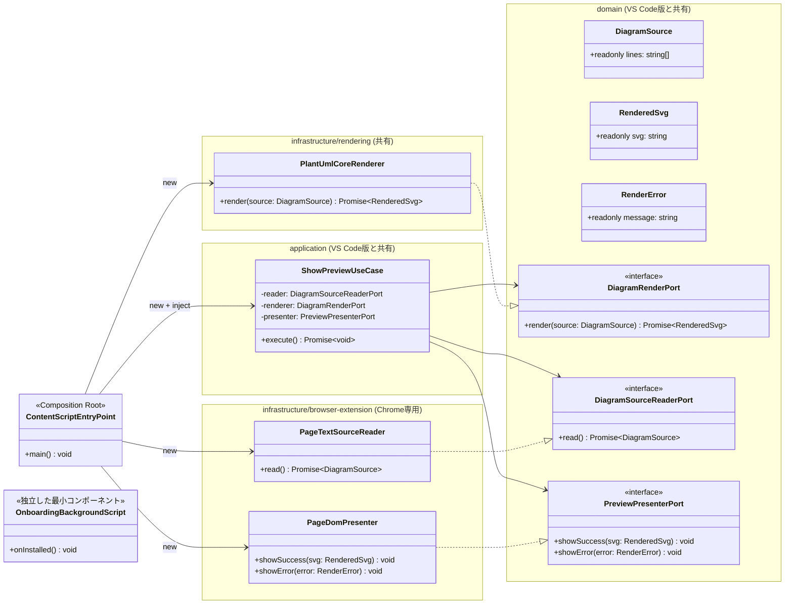
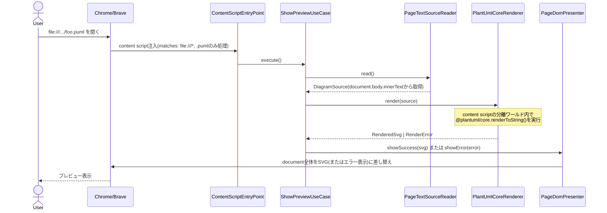
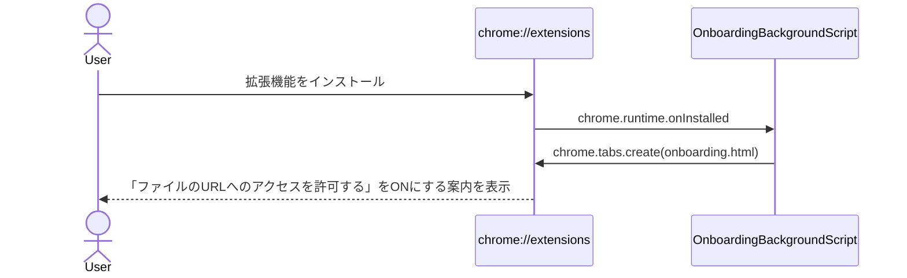

> **2026-08-20に一度スコープ外・不採用としたが、2026-08-21 オーナー指示によりスコープ復活。**
> 「Brave版を他のマシンからインストールできるようにしてほしい」という要望を受け、正式スコープとして
> `browser-extension/` に実装を昇格させた。実装・品質改善の詳細は
> `docs/design/browser-extension-v2-lazy-loading.md` を参照。

# 設計: Chrome拡張機能(ローカル `.puml` を `file://` で開くとその場でプレビュー)

- 前提: `docs/design/browser-extension-spike-report.md` で成立確認済み(status: need-review →
  ユーザー実機確認済み、司令塔承認済み)
- レイヤー構成・依存方向のルールは `docs/design/architecture.md` に従う
- domain層・application層は `docs/design/step2-vscode-extension-design.md` のVS Code拡張機能と
  **完全に共有**する(`ShowPreviewUseCase` はコード変更なしで両ターゲットから利用)

## スコープ

- Chromeで(Braveなど他のChromium系ブラウザも含む)ローカルの `.puml` ファイルを `file://` で
  直接開くと、その場でSVGにレンダリングされたプレビューが表示される。それだけ。
- VS Code拡張機能側と同じ禁止事項に準ずる: エクスポート・スニペット・多言語・マルチページ図は
  実装しない。
- ライブ更新(ファイル変更検知による再レンダリング)は**スコープ外**。ページを開いた/リロード
  した時点の内容を1回レンダリングする。
- 唯一の例外的な追加要素: **初回インストール時のオンボーディング案内**(「ファイルのURLへの
  アクセスを許可する」を手動でONにする必要があることをユーザーに伝える)。これは機能追加では
  なく、スパイクで判明した必須UXギャップを埋めるものであり、実施しない場合は拡張機能が
  何もしているように見えない(content scriptが発火せず無反応)ため必須と判断する。

## 設計判断1: `application/ShowPreviewUseCase` をVS Code版と共有する

`step2-vscode-extension-design.md` で `DiagramSourceReaderPort.read()` を引数なしに
リファクタ済み(「何を読むか」はReader実装のコンストラクタで解決する設計)。これにより
Chrome拡張機能でも同一の `ShowPreviewUseCase` をそのまま使う。

- VS Code: `VsCodeWorkspaceFsSourceReader` がコンストラクタで受け取った `vscode.Uri` を読む
- Chrome拡張機能: `PageTextSourceReader` は常に「現在のページ(=開いている `.puml` ファイル)」
  を読む。ページ自体が1ファイル1タブなので引数は不要。

## 設計判断2: `infrastructure/rendering/PlantUmlCoreRenderer` をVS Code版と共有する

`spike-report.md`(VS Code側)と `browser-extension-spike-report.md`(Chrome側)の両方で
`@plantuml/core.renderToString()` の呼び出しコード自体は完全に同一で動作することを確認済み
(DOM非依存、Web Worker・Node(CommonJS)・content script(分離ワールド)のいずれでも動く想定)。
そのため `PlantUmlCoreRenderer` はターゲット非依存の共有infrastructureモジュールとして
`src/infrastructure/rendering/` に1つだけ置く。ビルド時にesbuildで各ターゲット用バンドルに
含める(ソースの重複はしない)。

## 設計判断3: WASM実行はcontent script内(=ページの分離ワールド)で行う

VS Code版のようにWebviewとCSPを分離してWASM実行場所をずらす必要はない。Chrome拡張機能の
content scriptはページの分離ワールドで実行され、そこには特別なCSP制限は課されない
(拡張機能自身のCSPが適用されるのは拡張機能ページであり、content scriptが注入先ページの
狭いCSPの影響を受けるかはページ依存だが、`file://` ページ自体はCSPを持たないため問題にならない
ことをスパイクで確認済み)。よってVS Code版のような「計算は別コンテキストで行いSVG文字列だけ
渡す」という分離は不要で、**content script内で読み込み・レンダリング・DOM描画まで一気通貫**に行う。

## クラス図



`OnboardingBackgroundScript` は `ShowPreviewUseCase` を経由しない独立した最小コンポーネント
(拡張機能インストール時に案内ページを開くだけ)。domain/applicationとは無関係なので
クラス図上は接続しない。

## シーケンス(概要)





## 依存関係チェック(architecture.mdのルールとの整合)

- `domain/`・`application/ShowPreviewUseCase`: VS Code版から一切変更なし。Chrome/DOM/vscode
  いずれにも依存しない。
- `infrastructure/rendering/PlantUmlCoreRenderer`: VS Code版と共有。`@plantuml/core` にのみ依存。
  `vscode` にも `chrome.*` にもDOMグローバルにも依存しない(呼び出し元から `DiagramSource` を
  受け取りSVG文字列を返すだけの純粋な関数的クラス)。
- `infrastructure/browser-extension/`: `document`・`chrome.*` API への依存はここに閉じ込める。
  `PageTextSourceReader` は `document.body.innerText` を読む。`PageDomPresenter` は
  `document.documentElement` を書き換える。
- `entrypoints/browser-extension/content.ts`(`ContentScriptEntryPoint`): 具象クラスをnewして
  ユースケースに注入するのみ。`.puml` 拡張子判定(`location.pathname.endsWith(".puml")`)も
  ここで行う(ユースケース実行の可否を決める配線ロジックであり、ドメインロジックではないため)。

## manifest.json 構成方針(Manifest V3)

```json
{
  "manifest_version": 3,
  "name": "PlantUML Anywhere",
  "version": "0.0.1",
  "description": "ローカルの.pumlファイルをブラウザだけでその場プレビュー。サーバー送信なし。",
  "content_scripts": [
    {
      "matches": ["file:///*"],
      "js": ["content.js"],
      "run_at": "document_end"
    }
  ],
  "background": {
    "service_worker": "background.js"
  }
}
```

- `host_permissions` は `content_scripts.matches` に `file:///*` を書くだけで足りる
  (スパイクの `ext/manifest.json` と同じ形)。追加の `permissions` は不要
  (`chrome.tabs.create` はbackground service workerからのみ使うため `tabs` permission が
  必要になる可能性がある。実装時に最小権限で確定する)。
- `icons` はPoCでは省略可(必須ではない)。

## ビルド方針

- `content.ts` は esbuild で `--bundle --format=iife --platform=browser` の単一ファイルに
  バンドルする(content scriptはESM importができないため)。スパイクと同じ方式。
- `--minify` を適用する(スパイクで17.8MB→7.5MBの削減を確認済み)。
- `background.ts` は極小(onInstalledのみ)なので同様に esbuild でバンドルする。

## テスト方針(TDD, Red→Green→Refactor)

1. `ShowPreviewUseCase` のユニットテストは **VS Code版と共有**(同一のテストファイル/
   同一のテスト対象クラス)。重複実装しない。
2. `PageTextSourceReader` / `PageDomPresenter` の単体テスト
   - `jsdom` 等でDOMをモックし、`document.body.innerText` からの読み取り、
     `document.documentElement` の書き換えを確認する
3. `PlantUmlCoreRenderer` の結合テストはVS Code版と共有(同一クラスなので同一テスト)。
4. 実機起動確認
   - Playwright + `launchPersistentContext`(`--load-extension`)で、スパイクと同じ手順を
     自動テスト化する(`spikes/browser-extension/check-render.mjs` をテストコードとして
     昇格させる)。
   - **パック済み拡張機能でのfile://アクセス許可の実機確認は、可能であればこの段階で行う**
     (スパイクレポートの未解決事項)。難しい場合は司令塔に相談のうえ手動確認に切り替える。

## 未確定事項(実装中に確認し、必要なら設計更新して再レビュー)

1. パック済み(ストア配布相当)拡張機能でのfile://アクセス許可のデフォルト値(スパイクの
   申し送り事項、未解決のまま持ち越し)。
2. `chrome.tabs.create` に必要な `permissions` の具体的な最小セット。
3. オンボーディングページ(`onboarding.html`)の内容は最小限のテキスト+スクリーンショットで
   構成する想定だが、具体的なコピーは実装時に決める。
4. バンドルサイズの追加最適化(`emoji.js`/`openiconic.js`を含めない構成を
   `@plantuml/core` から取り出せるか)はVS Code版と共通の課題として扱う。
