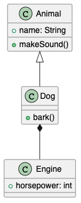

> **2026-08-20に一度スコープ外・不採用としたが、2026-08-21 オーナー指示によりスコープ復活。**
> 詳細は `docs/design/browser-extension-design.md` 冒頭の注記を参照。

# スパイクレポート: Chrome拡張機能によるローカル `.puml` 直接プレビュー

- 実施日: 2026-08-20
- 対象: 単体Chrome拡張機能(Manifest V3)、VS Code非依存
- 検証コード: `spikes/browser-extension/`
- 計画: `docs/design/browser-extension-spike-plan.md`(本レポートにより実施済みに更新)

## 結論(要約)

**成立する見込みが高い。ただし1点、実機未検証のまま残る重要な制約がある。**

- ローカルの `.puml` ファイルを `file://` で直接開いたとき、Chromeはダウンロードせず
  `text/plain` としてタブ内に表示することを確認した(最優先リスクはクリア)。
- Manifest V3のcontent scriptがそのページに介入し、DOMを差し替えられることを確認した。
- content script内で `@plantuml/core` のWASMレンダリングを実行し、クラス図(継承+
  コンポジション)を実際にSVG化・画面表示できることを確認した(判定基準の全項目を満たす)。
- **一方で、今回の検証は「開発者モードでunpacked拡張機能をロードした」状態であり、
  この状態ではfile://アクセス許可がデフォルトで有効になっていた。** Chrome Web Store
  経由で配布・インストールされた通常の(packed)拡張機能では、file://アクセスは
  **デフォルト無効**で、ユーザーが `chrome://extensions` の詳細画面で
  「ファイルのURLへのアクセスを許可する」を**手動でON**にする必要があるというのが
  Chromeの一般的な仕様(Chrome Developer向け公式ドキュメントに明記されている制約)。
  この手動許可ステップは自動化・省略できない。**ストア配布後の実機確認はまだ行っていない**
  ため、正直に未検証として記録する。

## 検証方法と結果

### 1. `.puml` を `file://` で直接開いたときの挙動(拡張機能なし)

`spikes/browser-extension/check-file-open.mjs` でPlaywright(Chromium)を使い、拡張機能なしの
状態で `file:///.../test.puml` に遷移して確認。

結果:
```
NAVIGATION_OK
response headers: {"content-type":"text/plain","last-modified":"..."}
downloadStarted: false
current URL: file:///.../test.puml
body innerText (先頭200文字): @startuml ... @enduml
```

- ダウンロードイベントは発生せず、`text/plain` としてタブ内にプレーンテキスト表示された。
- `document.body.innerText` でファイル内容を取得できることを確認(content scriptで
  ソースを読み取る前提が成立)。

### 2. content scriptがfile://ページに介入できるか

`spikes/browser-extension/ext/manifest.json`(`matches: ["file:///*"]`)+
`content.js` で、DOM挿入マーカーを立てるだけの最小content scriptを作成し、
`spikes/browser-extension/check-extension.mjs` でPlaywrightの
`launchPersistentContext` + `--load-extension` により拡張機能をロードして確認。

結果:
```
marker text: INJECTED_OK
content script injected: true
```

- content scriptが正常に発火し、DOMを操作できることを確認。

### 3. WASMレンダリングをcontent script内で実行できるか(判定基準: 一気通貫でのSVG表示)

`spikes/browser-extension/content-src.mjs` に、ページのテキストを読み取り
`@plantuml/core` の `renderToString()` でレンダリングしてDOMを置き換える処理を実装し、
esbuildで単一ファイル(`ext/content.js`)にバンドル。`spikes/browser-extension/check-render.mjs`
で実行し、生成されたSVGを保存・スクリーンショットで目視確認した。

結果:
```
result: {
  "hasResult": true,
  "resultHtmlLength": 4351,
  "hasError": false,
  ...
}
```

- 生成SVG: `spikes/browser-extension/class-diagram-from-extension.svg`
  (座標はVS Code側スパイクと完全に同一 = 3クラスが重ならず縦に配置、継承・コンポジションの
  矢印も正しく描画)
- 目視確認用スクリーンショット: `spikes/browser-extension/class-diagram-from-extension.png`

  

- コンソールログにPlantUML内部のパース・レイアウト処理ログが出力されており、
  content script(ページの分離ワールド)内でWASM実行が問題なく動作することを確認した。

## 重要な注意点: file://アクセス許可のデフォルト値(未検証のまま残るリスク)

`--load-extension` でロードした拡張機能のプロファイル設定(`Secure Preferences` 内
`extensions.settings.<id>.newAllowFileAccess`)を直接確認したところ、**`true`** だった:

```
id: fihepminboocfecapdjnogilgmdggaaf
newAllowFileAccess: true
location: 8   (= unpacked/開発者モードロード)
```

- これは「開発者モードでunpacked拡張機能をロードした場合、file://アクセスは
  デフォルトで有効になる」ことを示している。今回の1〜3の検証すべてが、この
  デフォルト許可状態の上で成功している。
- Chrome Web Store配布(パック済み拡張機能としてインストール)の場合、この
  `newAllowFileAccess` のデフォルト値が `false` になり、ユーザーが `chrome://extensions`
  の拡張機能詳細画面を開いて手動でトグルをONにする必要がある、というのが一般に知られている
  Chromeの仕様(拡張機能側のコードや `manifest.json` からこれを自動有効化する手段はない)。
- **ただし本スパイクでは、パック済み拡張機能をインストールした状態での実機確認は
  行っていない。** ストア公開前のCRXパッケージや `chrome://extensions` の「パッケージ化」
  機能を使って再現・確認することが望ましいが、今回はスパイクの時間対効果を優先し未実施。
- 結論として、**設計上はこの手動許可ステップをオンボーディングUXに組み込む前提とする**
  (例: 拡張機能の初回起動時に「ファイルURLへのアクセスを有効にしてください」という案内を
  表示し、`chrome://extensions/?id=...` へのリンクを示す、等)。これはCLAUDE.mdでいう
  「実装できるが要注意」の技術リスクとして次の設計ドキュメントに明記する。

## バンドルサイズ

content script はページの分離ワールドで実行される1個のJSファイルとして配布する必要があり、
`@plantuml/core` (`plantuml.js` + `viz-global.js`)をesbuildで単一ファイルにバンドルした。

| ビルド | サイズ |
|---|---|
| バンドルのみ(minifyなし) | 17.8MB |
| `--minify` 適用後 | 7.5MB |

- VS Code拡張機能スパイクで見たインストールサイズ(10MB)よりも、Chrome拡張機能の
  content script単体バンドルの方がminify前で大きい(17.8MB)。これはVS Code側は
  `plantuml.js`/`viz-global.js` をファイルとして個別配布できるのに対し、content scriptは
  仕様上1ファイルにバンドルする必要があるための差。
- Chrome Web Storeの拡張機能パッケージサイズは公式には非常に大きな上限(数百MB〜)が
  許容されているため配布自体は問題にならない見込みだが、初回インストール・起動時間への
  影響は次フェーズで実測すべき。

## 未解決の懸念・次の設計フェーズへの申し送り事項

1. **file://アクセス許可の手動ステップをオンボーディングUXにどう組み込むか**(最重要、上述)。
2. パック済み拡張機能(ストア配布相当)での実機確認がまだ。開発者モード限定の挙動である
   可能性を完全には排除できていない。
3. `manifest.json` の `matches` は `file:///*` (全ファイルURL)としたが、実装時は
   `.puml` 拡張子のみに絞れるか(content scriptのmatch patternはファイル名パターンでの
   絞り込みができないため、実際にはcontent.js内で `location.pathname.endsWith(".puml")`
   による絞り込みが必須。これは今回の実装と同じ方式で問題ない)。
4. content scriptがページの `<html>` 全体を上書きする実装になっているため、Chrome標準の
   プレーンテキストビューア機能(検索・折り返し等)と衝突しないかは実装時に確認する。
5. バンドルサイズ最適化(sprite類の除外、tree-shaking)はVS Code版と共通の課題として
   後続で扱う。

## 添付ファイル(`spikes/browser-extension/` 配下)

- `test.puml` — 検証用ソース(VS Codeスパイクと同一内容)
- `check-file-open.mjs` — 拡張機能なしでのfile://挙動確認スクリプト
- `ext/manifest.json` / `ext/content.js`(バンドル済み) — 検証用Chrome拡張機能一式
- `content-src.mjs` — content scriptのソース(バンドル前)
- `check-extension.mjs` — content script発火確認スクリプト
- `check-render.mjs` — レンダリング一気通貫確認スクリプト
- `check-permission-ui.mjs` — chrome://extensionsのDOM調査スクリプト(参考、最終的には
  プロファイルの `Secure Preferences` を直接読む方式に切り替えた)
- `class-diagram-from-extension.svg` / `.png` — 生成結果
