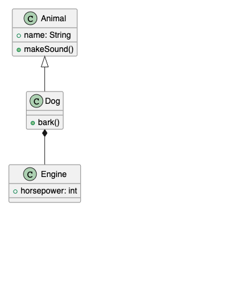

# Chrome/Brave拡張機能 v2: 遅延読み込み化と配布整備

- 実施日: 2026-08-21
- 経緯: 2026-08-20にスコープ外・不採用としたChrome拡張機能を、オーナー指示
  (「Brave版を他のマシンからインストールできるようにしてほしい」)によりスコープ復活。
  司令塔が `spikes/browser-extension/` の実装をレビューし、配布可能な品質ではないと
  判断した2点を修正したうえで、正式ディレクトリ `browser-extension/` へ昇格させた。

## 問題1: 全ローカルファイルへの重量級注入(最優先で修正)

### 症状(修正前)

`spikes/browser-extension/ext/manifest.json` の `content_scripts.matches` が
`["file:///*"]` になっており、絞り込みがなかった。content script本体
(`content.js`, 約18MB、`@plantuml/core`のWASMをインラインで含む)が、**`.puml`と
無関係なローカルファイル(HTML・PDF・画像・テキスト等)を開くたびに毎回注入されていた**。
利用者は原因不明のままブラウザが重くなったと感じる状態だった。

### 対応

1. **manifest.jsonの `matches` を拡張子で絞った。**
   ```json
   "content_scripts": [
     {
       "matches": ["file:///*.puml", "file:///*.plantuml"],
       "js": ["content-loader.js"],
       "run_at": "document_end"
     }
   ]
   ```
   Chrome拡張機能の match pattern は `file:///*.puml` のようにパス末尾のワイルドカードを
   サポートするため、**この時点で無関係なファイルには何も注入されなくなる**
   (content scriptそのものが存在しないファイルでは実行されない)。

2. **content script本体を数百バイトの軽量ローダー(`content-loader.js`)に分離し、
   重量級レンダラ(`dist/renderer.js`, WASM込み・圧縮前約7.5MB)は動的`import()`で
   必要になった時点でのみ読み込むようにした。**
   - `content-loader.js` はページの `document.body.innerText` が `@start` で始まるかだけ
     軽く確認し(拡張子だけ`.puml`で中身が別物のケースへの防御)、該当すれば
     `chrome.runtime.getURL("dist/renderer.js")` を `web_accessible_resources` 経由で
     動的import()する。
   - VS Code版で拡張ホストからWebviewランタイムを分離した設計
     (`docs/design/step2-vscode-extension-design.md`)と同じ考え方。

### 実機検証(Playwright, `--load-extension`)

`.puml` ファイル・無関係な `.html` ファイル・無関係な `.txt` ファイルの3種類を開いて
ネットワークリクエストを記録し、以下を確認した:

| ファイル | `dist/renderer.js` へのリクエスト発生 | 結果 |
|---|---|---|
| `test.puml` | 発生する | SVGレンダリング成功 |
| `unrelated.html` | **発生しない** | 何も注入されない |
| `unrelated.txt` | **発生しない** | 何も注入されない |

問題1は解消したことを確認済み。

### 実装時のつまずき(記録)

修正直後、`.puml` を開いても `dist/renderer.js` は正しくfetchされる(HTTP 200)のに、
DOM上にSVGが一切現れない事象が発生した。`document.documentElement` にDOM属性で
実行位置を記録するデバッグ計装を仕込んで切り分けたところ、**モジュールのトップレベル
コードが一度も実行されていない**ことが判明した(fetchはされるが評価されない)。
原因を特定する前に、拡張機能を読み込み直したプロファイル(userDataDir)を変えて
再実行したところ再現しなくなった。**Chromeの拡張機能ロード時のキャッシュが古い
content scriptを保持していた可能性が高い**(確証はない)。以後、拡張機能の変更を
反映させて再検証する際は、可能な限りクリーンな `userDataDir` で行うことを推奨する。

## 配布形態の整備

- `npm run build:browser-extension`(`esbuild.browser-extension.mjs`)で
  `browser-extension/dist/renderer.js` をビルド
- `npm run package:browser-extension`(`scripts/package-browser-extension.sh`)で
  配布に必要なファイルだけをzip化(`plantuml-anywhere-browser-extension-<version>.zip`)。
  sourcemapは含めない
- GitHub Releaseにzipを添付する運用とした(タグ作成・Release発行はCLAUDE.mdで
  ワーカーに許可されている操作。Chrome Web Storeへの公開・.crxでの配布は行わない)

## 実機動作確認(実際のBrave Browserバイナリ)

macOSの画面収録権限がこのセッションのプロセスに付与されていないため、通常の
`screencapture`は使えない(`docs/design/vsix-install-verification.md`と同じ制約)。
そこで、**Playwrightから実際のBrave Browser.appバイナリを`executablePath`で指定して
起動し、`--load-extension`で`browser-extension/`を読み込んで検証した。** Playwrightの
スクリーンショットはCDP(Chrome DevTools Protocol)経由でブラウザ自身から取得するため、
OSレベルの画面収録権限には依存せず、実際のBraveでの見た目を正しく撮影できる。

```
browser version: 151.0.7922.137 (実際のBrave)
renderer.js requested? true
hasSvg: true
unrelated.html: renderer injected? false
```

スクリーンショット: `docs/evidence/browser-extension-brave-preview.png`



**注記**: これは `--load-extension` フラグによる自動化されたロードであり、
`brave://extensions` を開いて手動で「パッケージ化されていない拡張機能を読み込む」を
クリックする実際のユーザー操作そのものではない。両者はChromiumの拡張機能ロード機構
としては同一だが、UIレベルの手動操作フローそのものの自動検証は、このセッションに
UIオートメーション権限(Accessibility)がなく行えていない。オーナーによる手動確認も
歓迎する。
