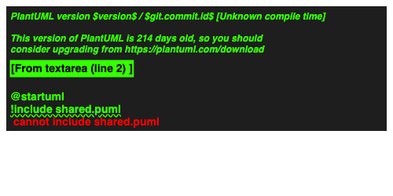
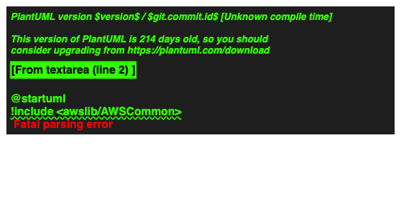

# 既知の穴の実測検証: ローカル`!include`・スプライトライブラリ

- 実施日: 2026-08-21
- 目的: CLAUDE.mdに当初から記載していた既知の制約(ローカル`!include`非対応、
  スプライトライブラリ非同梱)について、「実際にどう振る舞うか」を実機で確認し、
  利用者が困らない挙動になっているかを判断する(hq#35 司令塔指示)。

## 検証方法

`@plantuml/core`(`renderToString`)を実ブラウザ(Chromium, Playwright)で直接呼び出し、
以下2パターンのソースをレンダリングして結果を確認した。

1. ローカルファイルへの`!include`(存在しない相対パスを参照):
   ```
   @startuml
   !include shared.puml
   class Main
   Main --> SharedClass
   @enduml
   ```
2. AWSスプライトライブラリへの`!include`(未同梱のライブラリを参照):
   ```
   @startuml
   !include <awslib/AWSCommon>
   !include <awslib/Compute/EC2>
   EC2(myec2, "Web Server", "t3.micro")
   @enduml
   ```

(補足: 最初にNode+jsdom環境で検証したところ、jsdom固有の制約により正確な判定ができな
かった。1つ目は`getBBox()`未実装によるレイアウトエラー、2つ目は原因不明の10秒タイムアウト
が発生した。**これはjsdom環境固有の問題であり、実ブラウザでの挙動確認が必須と判断し、
Playwrightで実ブラウザ検証に切り替えた。**)

## 結果: どちらもハングせず、明確な赤字エラーがSVGとして正常に返る

**懸念していた「無言で固まる」「サイレントに壊れる」という最悪の挙動は発生しなかった。**
どちらのケースも、PlantUML自体が生成する**赤字の明示的なエラーメッセージ**が
SVG画像として正常にレンダリングされ、コールバックも「成功」として返ってくる
(内部的には`RenderedSvg`扱いになり、`RenderError`は発生しない)。

### 1. ローカル`!include`が見つからない場合

`cannot include shared.puml` という赤字メッセージがSVG内に表示される。



### 2. スプライトライブラリ(AWS)が見つからない場合

`Fatal parsing error` という赤字メッセージがSVG内に表示される。



## 利用者体験としての評価

- **ハング・無反応にはならない**: どちらも数百ms〜1秒程度で結果が返ってくる。
  ユーザーが「フリーズした」と誤解することはない。
- **エラー内容がSVG内に赤字で明記される**: 「なぜ表示されないか」が(英語だが)
  一応読み取れる。特にローカル`!include`の場合は `cannot include <ファイル名>` と
  対象ファイル名まで含まれており、原因の特定は難しくない。
- **一方で改善余地もある**: このエラー画像は「PlantUMLバージョンが古い」という
  無関係な警告文を含む、PlantUML本体のデバッグ的な出力そのものであり、洗練された
  UIエラー表示ではない。また、私たちの拡張機能のコード上は`RenderedSvg`として
  扱われるため(`RenderError`にはならない)、Webview側でエラー用の見た目
  (`WebviewPreviewPresenter`の`showError`)は適用されず、通常のプレビュー表示と
  同じ扱いになる。

## 対応方針(このPoCでの結論)

- 現状の挙動(ハングしない・エラー内容が読める)は、PoCとして**利用者が致命的に
  困る状態ではない**と判断し、追加のエラーハンドリング実装は行わない
  (CLAUDE.mdのPoCスコープ: 機能追加は最小限に留める方針と整合)。
- README に、この2点の既知の制約について「エラーになる」ことを明記し、
  実際にどう見えるかも一言添えて正直に記載する(利用者が事前に把握できるように)。
- 将来的な改善案(スコープ外、メモのみ): PlantUMLの出力に含まれる特定の文字列
  (`cannot include`, `Fatal parsing error` 等)を検出し、`RenderError`として
  明示的に扱い直す、といった対応が考えられる。
