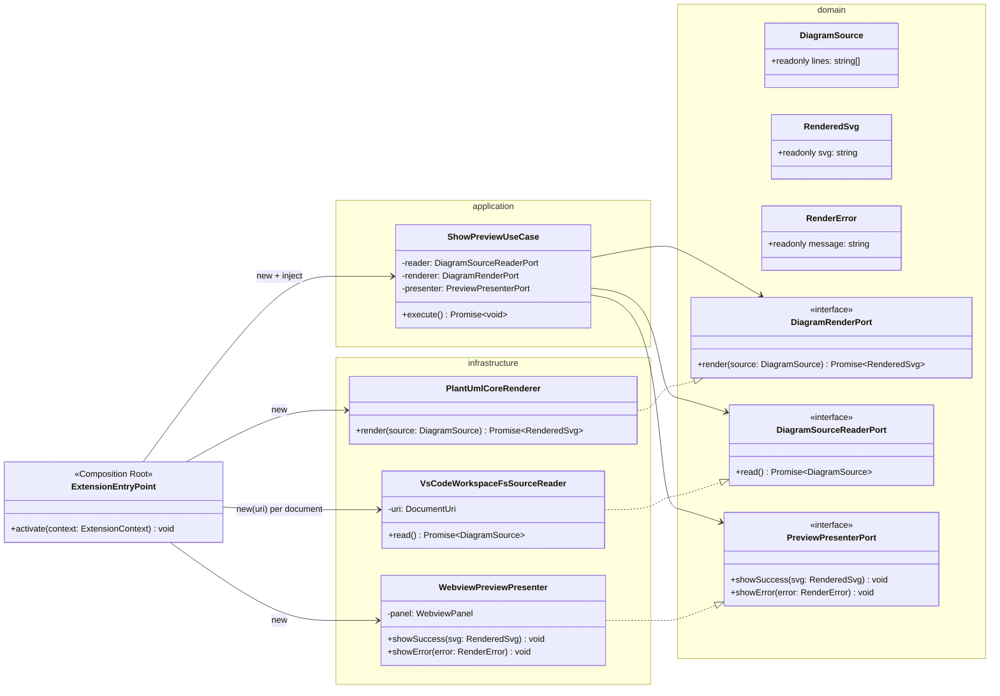
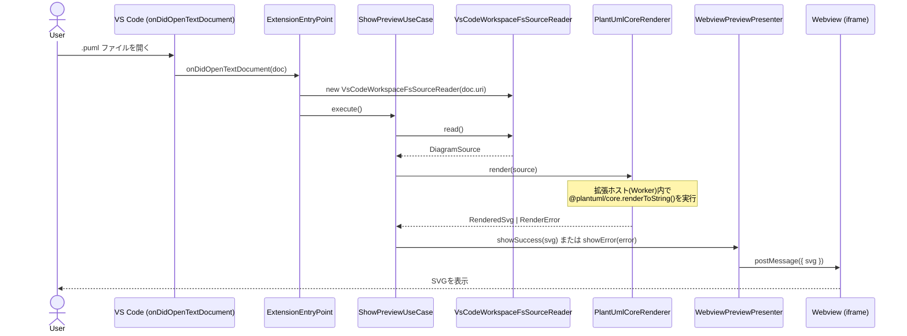

# ステップ2設計: 最小のVS Code拡張機能(Web版・デスクトップ版共通、.pumlを開くとプレビューが出る、それだけ)

- 前提: `docs/design/spike-report.md` でクラス図レンダリングの成立を確認済み(status: need-review → HQ承認済み)
- レイヤー構成・依存方向のルールは `docs/design/architecture.md` に従う
- 2026-08-20 司令塔確認: VS Code拡張機能はWeb版(vscode.dev/github.dev)とデスクトップ版の
  **両対応**とする(`docs/design/architecture.md`「配布ターゲット」参照)。Chrome拡張機能は
  別スコープであり本ドキュメントの対象外(専用スパイク・専用設計ドキュメントで扱う)。

## スコープ

- `.puml` ファイルを開くと、Webviewにレンダリング結果(SVG)が表示される。それだけ。
- エクスポート・スニペット・多言語・マルチページ図は実装しない(CLAUDE.md記載の禁止事項)。
- ライブ更新(編集中の再レンダリング)は**PoCスコープ外**とする。開いた時点の内容を1回
  レンダリングする。理由: CLAUDE.mdの「.pumlを開くとプレビューが出る、それだけ」という
  スコープを厳密に守るため。将来必要になった場合はステップ3として司令塔に提案する。

## 設計判断: レンダリング(WASM実行)は拡張ホスト側で行う

`spike-report.md` の検証結果を踏まえた判断:

- VS Code拡張機能の拡張ホストは、Web版ではブラウザ内のWeb Worker、デスクトップ版では
  Node.jsプロセス上で動く(いずれもWebview=iframeとは別の実行コンテキスト)。
- `@plantuml/core` の `renderToString()` はDOM不要でSVG文字列を返す関数であり、Web Worker
  コンテキストでも動作する想定(`document`/`location` 未定義時のフォールバック分岐を
  スパイクで確認済み。Workerには `location` があるため問題の分岐には入らない)。
- Webview側はVS Codeが厳格なCSPを課すため、WASM実行(`WebAssembly.instantiate`)には
  `'wasm-unsafe-eval'` 等の追加許可が必要になる可能性がある(spike-reportの申し送り事項)。
- そこで **WASMによるレンダリング計算は拡張ホスト側(infrastructure層)で行い、
  Webviewには計算済みのSVG文字列(ただのテキスト)だけを `postMessage` で渡す**設計とする。
  これによりWebview側のCSPはWASM実行を許可する必要がなくなり、CSPは
  `default-src 'none'; style-src {cspSource}; img-src data:;` 程度の最小構成で済む見込み。
- この判断が実機(`@vscode/test-web`)で成立しない場合(拡張ホストWorkerでWASMが動かない場合)は、
  設計を更新しWebview側実行+CSP拡張に切り替える。その場合は再度司令塔にレビュー依頼する。

### デスクトップ版特有の未検証事項

- スパイクではNode上での直接実行(ESM)が `viz-global.js` の
  `document`/`location` 未定義時フォールバック分岐で `require is not defined` エラーになった
  (`spike-report.md` 参照)。これは **ESMコンテキストで `require`/`__filename` が
  存在しない**ことが原因であり、CommonJSとしてバンドルされた拡張(VS Code拡張は通常
  webpack/esbuildでCommonJS一本にバンドルする)では `require`/`__filename` が存在するため、
  この分岐に入っても失敗しない可能性が高い。ただし**未実機検証**であり、
  デスクトップ版の起動確認時(後述テスト方針3)に合わせて確認する。
  ここで問題が出た場合は、デスクトップ版でも同じくWebview側やWorker Threadでの実行に
  切り替える設計変更を検討し、司令塔に再レビュー依頼する。

## クラス図

`DiagramSourceReaderPort.read()` は引数を取らない設計にした。「何を読むか」はReaderの
生成時(コンストラクタ)にターゲットごとの手段で解決する(VS Codeは対象 `vscode.Uri` を
注入、Chrome拡張機能は常に現在のページを読む=引数不要)。これにより `ShowPreviewUseCase`
をVS Code版・Chrome拡張版で**完全に同一のコード**として共有できる
(`docs/design/browser-extension-design.md` 参照)。

## シーケンス(概要)

## 依存関係チェック(architecture.mdのルールとの整合)

- `domain/`(`DiagramSource`, `RenderedSvg`, `RenderError`, 各Port interface): vscode・
  `@plantuml/core` を一切importしない。
- `application/ShowPreviewUseCase`: `domain/` のPort interfaceのみに依存。`infrastructure/` の
  具象クラス名を一切importしない。
- `infrastructure/`: `vscode` と `@plantuml/core` への依存はここに閉じ込める。
  `VsCodeWorkspaceFsSourceReader` は `vscode.workspace.fs.readFile` を使用(Node `fs` 不使用)。
- `extension.ts`(`ExtensionEntryPoint`): 具象クラスをnewしてユースケースに注入するのみ。
  ロジックを持たない。

## package.json 構成方針

- `browser` と `main` の両フィールドでエントリポイントを指定する(Web版・デスクトップ版共通)。
  ソースは同一の `src/entrypoints/vscode-extension.ts` を指し、ビルド時に
  `target: webworker`(browser用)と `target: node`(main用)の2種類のバンドルを出力する
  (esbuildの `--platform=browser`/`--platform=node` 相当を想定。ビルド設定の詳細は
  実装フェーズで確定する)。
- `activationEvents`: `onLanguage:plantuml`(`.puml` を開いたときに起動)。
- `contributes.languages`: `.puml` 拡張子を `plantuml` 言語IDに関連付け(最小限、シンタックス
  ハイライト等の追加機能は実装しない)。

## テスト方針(TDD, Red→Green→Refactor)

実装着手時は以下の順で先にテストを書く:

1. `ShowPreviewUseCase` のユニットテスト(domain/applicationのみ、vscode不要)
   - 正常系: reader→renderer→presenter.showSuccess が呼ばれる
   - 異常系: renderer が失敗した場合 presenter.showError が呼ばれる
   - reader/renderer/presenterはテストダブル(フェイク実装)を注入する
2. `PlantUmlCoreRenderer` の結合テスト
   - スパイクで確認したクラス図入力を渡し、SVGが返ることを確認(spike-reportの検証を
     プロダクトコードとして再現するテスト)
3. 起動確認(Web版・デスクトップ版それぞれ)
   - Web版: `@vscode/test-web` でブラウザ環境として起動し、`.puml` を開いてWebviewに
     SVGが表示されることを確認する。
   - デスクトップ版: `@vscode/test-electron`(通常のVS Code拡張テストランナー)で
     起動し、同様に `.puml` を開いてWebviewにSVGが表示されることを確認する。
     ここで「デスクトップ版特有の未検証事項」(WASM実行可否)も合わせて確認する。

## 未確定事項(実装中に確認し、必要なら設計更新して再レビュー)

1. 拡張ホストのWeb Worker内で `@plantuml/core` のWASMが実際に動くか(未実機検証)。
   動かない場合はWebview側実行+CSP拡張に設計変更。
2. `emoji.js` / `openiconic.js` を同梱せずに `plantuml.js` + `viz-global.js` のみで
   動作するか(バンドルサイズ削減のため)。
3. `dependency-cruiser` のルール設定の具体的な構文(実装時にpyproject.toml相当として
   `.dependency-cruiser.js` を作成)。
