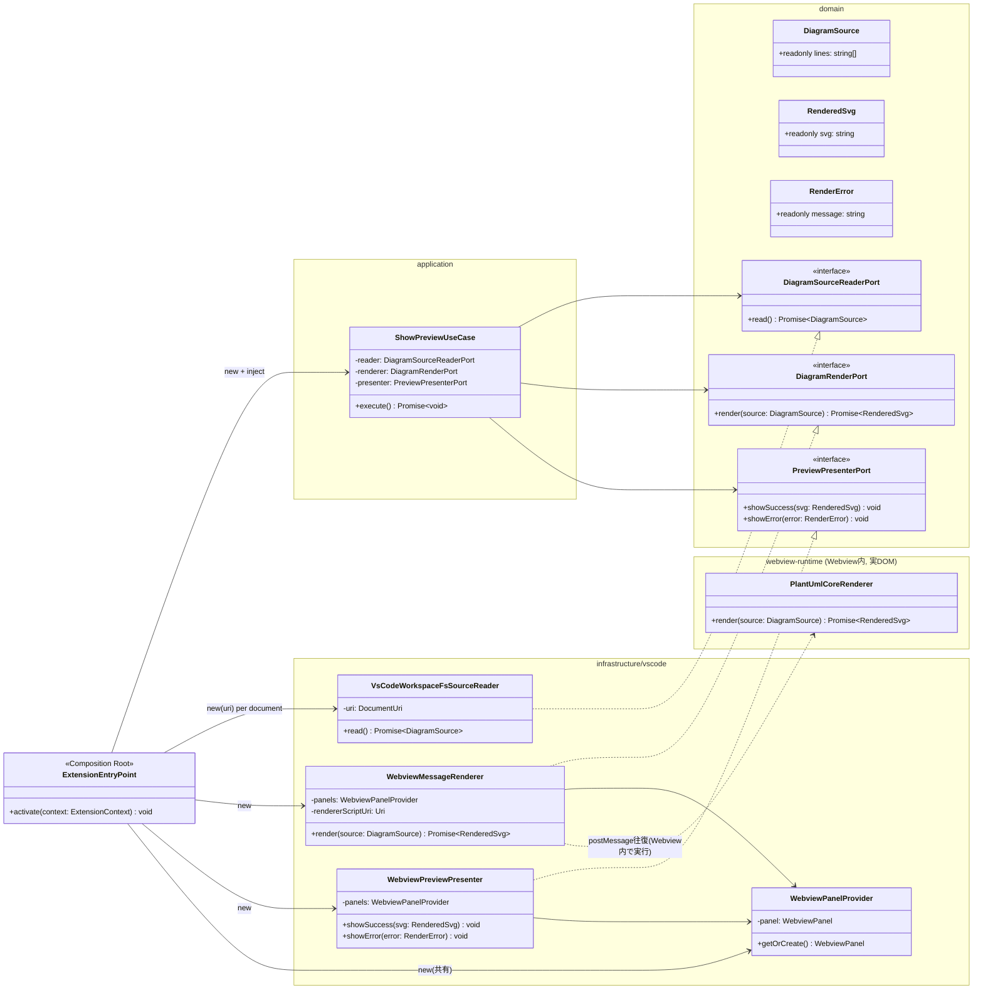
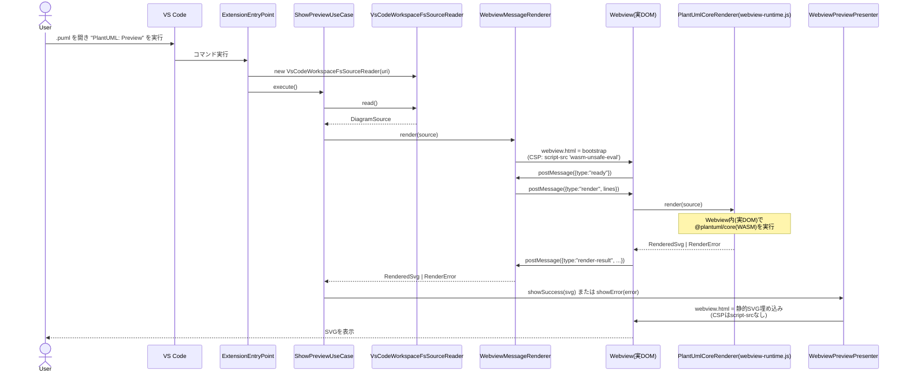

# ステップ2設計: 最小のVS Code拡張機能(Web版・デスクトップ版共通、.pumlを開くとプレビューが出る、それだけ)

- 前提: `docs/design/spike-report.md` でクラス図レンダリングの成立を確認済み(status: need-review → HQ承認済み)
- レイヤー構成・依存方向のルールは `docs/design/architecture.md` に従う
- 2026-08-20 司令塔確認: VS Code拡張機能はWeb版(vscode.dev/github.dev)とデスクトップ版の
  **両対応**とする(`docs/design/architecture.md`「配布ターゲット」参照)。Chrome拡張機能は
  別スコープであり本ドキュメントの対象外(専用スパイク・専用設計ドキュメントで扱う)。

## スコープ

- `.puml` ファイルを開くと、Webviewにレンダリング結果(SVG)が表示される。それだけ。
- エクスポート・スニペット・多言語・マルチページ図は実装しない(CLAUDE.md記載の禁止事項)。
- ライブ更新(編集中の再レンダリング)は**PoCスコープ外**とする。開いた時点の内容を1回
  レンダリングする。理由: CLAUDE.mdの「.pumlを開くとプレビューが出る、それだけ」という
  スコープを厳密に守るため。将来必要になった場合はステップ3として司令塔に提案する。

## 設計判断(2026-08-20 実機検証により確定): レンダリング(WASM実行)はWebview側で行う

**この節は当初の設計から修正されている。** 当初は「WASMレンダリングは拡張ホスト側
(Web Worker/Node)で行い、Webviewには計算済みSVG文字列だけを渡す」設計だった
(WebviewのCSP `wasm-unsafe-eval` 問題を避けるため)。

しかし `@vscode/test-web`(`--esm`, headless, 実際のChromiumで動くVS Code Web)による
実機検証で、**拡張ホスト(Web Worker)には `window` が存在せず、`@plantuml/core` は
SVGレイアウト計算に `window`/DOM(テキスト幅計測やSVG `getBBox()` など)を要求するため、
`ReferenceError: window is not defined` で失敗する**ことが判明した(vitestのjsdom環境で
先に見つかっていた「クラス図はgetBBoxが必要」という制約と符合する事実で、
「実DOMが必須」という当初見落としていた要件がここで確定した)。

したがって設計を以下のとおり修正した:

- **レンダリング(WASM実行)は実DOMを持つWebview側で行う。** 拡張ホスト側の
  `WebviewMessageRenderer`(`DiagramRenderPort` 実装)は、Webviewパネルに
  `postMessage` でソースを送り、Webview内で動く `webview-runtime.js`
  (`@plantuml/core` を含む別バンドル)が実際にレンダリングして結果を
  `postMessage` で返す、というメッセージ往復方式にした。
- Webview側のCSPには `script-src {cspSource} 'wasm-unsafe-eval'` が実際に必要で
  (`WebviewMessageRenderer.buildBootstrapHtml` 参照)、実機でこの設定により
  WASM実行が成功することを確認した。
- 最終表示(`WebviewPreviewPresenter`)は従来どおり計算済みSVGを埋め込むだけなので、
  そちらのCSPは `script-src` を含まない最小構成のままでよい(WASM実行後、
  同じWebviewパネルの `html` を静的表示用に差し替える)。
- **副産物として拡張ホスト本体(`dist/extension.js`)から `@plantuml/core` が
  外れ、7.5MB→8KBに縮小した。** WASM(7.5MB)はWebviewを開いたときだけ遅延ロードされる
  `dist/webview-runtime.js` に分離されている。起動時間の観点で望ましい副次効果。

### 実機検証結果

`@vscode/test-web --headless --esm` + `--extensionTestsPath` によるE2E確認
(`test-web/index.ts`)で以下を確認済み:

```
languageId: "plantuml"
extensionActiveBeforeCommand: true   (onStartupFinished追加後)
webviewOpened: true
outcome: { ok: true, svgLength: 4205 }
```

`svgLength: 4205` は `spikes/class-diagram.svg`(Playwrightでの素のブラウザ検証)と
完全に同一で、座標も一致している。生成されたSVGを実際にスクリーンショット化したものを
`test-fixtures/vscode-web-preview.png` に保存した(Issue完了条件の証跡)。

### 副次的に判明した点: `onDidOpenTextDocument` によるレース

`.puml` を開く操作自体が `activationEvents: ["onLanguage:plantuml"]` の発火条件でもあるため、
拡張の `activate()` 完了(＝`onDidOpenTextDocument` リスナー登録)より先にイベントが
発火してしまい、**初回だけ自動プレビューが効かないことがある**(レースコンディション)。
`activationEvents` に `onStartupFinished` を追加し、拡張を早期にactivateしておくことで
回避した。Issueの完了条件は「開いてコマンド実行→プレビュー」であり自動オープンは
必須要件ではないため、コマンド経由のフローは常に問題なく動作する。

## クラス図



`PlantUmlCoreRenderer` は拡張ホストからは直接呼ばれない(`window` が無く動かないため)。
`webview-runtime.js` という別バンドルとしてWebviewにのみ読み込まれ、
`WebviewMessageRenderer` からの `postMessage` を受けて実行される。

`DiagramSourceReaderPort.read()` は引数を取らない設計にした。「何を読むか」はReaderの
生成時(コンストラクタ)にターゲットごとの手段で解決する(VS Codeは対象 `vscode.Uri` を
注入、Chrome拡張機能は常に現在のページを読む=引数不要)。これにより `ShowPreviewUseCase`
をVS Code版・Chrome拡張版で**完全に同一のコード**として共有できる
(`docs/design/browser-extension-design.md` 参照)。

## シーケンス(概要)



## 依存関係チェック(architecture.mdのルールとの整合)

- `domain/`(`DiagramSource`, `RenderedSvg`, `RenderError`, 各Port interface): vscode・
  `@plantuml/core` を一切importしない。
- `application/ShowPreviewUseCase`: `domain/` のPort interfaceのみに依存。`infrastructure/` の
  具象クラス名を一切importしない。
- `infrastructure/vscode/`: `vscode` への依存はここに閉じ込める。`@plantuml/core` は
  ここには置かない(拡張ホストには`window`が無く動かないため)。
  `VsCodeWorkspaceFsSourceReader` は `vscode.workspace.fs.readFile` を使用(Node `fs` 不使用)。
- `webview-runtime/`(Webview内で動く別バンドル): `@plantuml/core` への依存はここに閉じ込める。
  `vscode` APIには依存しない(Webview内から直接vscode APIは呼べないため、
  `acquireVsCodeApi()` 経由のpostMessageのみで拡張ホストとやり取りする)。
- `extension.ts`(`ExtensionEntryPoint`): 具象クラスをnewしてユースケースに注入するのみ。
  ロジックを持たない。

## package.json 構成方針

- `browser` と `main` の両フィールドでエントリポイントを指定する(Web版・デスクトップ版共通)。
  ソースは同一の `src/entrypoints/vscode-extension.ts` を指し、ビルド時に
  `target: webworker`(browser用)と `target: node`(main用)の2種類のバンドルを出力する
  (esbuildの `--platform=browser`/`--platform=node` 相当を想定。ビルド設定の詳細は
  実装フェーズで確定する)。
- `activationEvents`: `onLanguage:plantuml`(`.puml` を開いたときに起動)。
- `contributes.languages`: `.puml` 拡張子を `plantuml` 言語IDに関連付け(最小限、シンタックス
  ハイライト等の追加機能は実装しない)。

## テスト方針(TDD, Red→Green→Refactor)

実装着手時は以下の順で先にテストを書く:

1. `ShowPreviewUseCase` のユニットテスト(domain/applicationのみ、vscode不要)
   - 正常系: reader→renderer→presenter.showSuccess が呼ばれる
   - 異常系: renderer が失敗した場合 presenter.showError が呼ばれる
   - reader/renderer/presenterはテストダブル(フェイク実装)を注入する
2. `PlantUmlCoreRenderer` の結合テスト
   - スパイクで確認したクラス図入力を渡し、SVGが返ることを確認(spike-reportの検証を
     プロダクトコードとして再現するテスト)
3. 起動確認(Web版・デスクトップ版それぞれ)
   - Web版: `@vscode/test-web` でブラウザ環境として起動し、`.puml` を開いてWebviewに
     SVGが表示されることを確認する。
   - デスクトップ版: `@vscode/test-electron`(通常のVS Code拡張テストランナー)で
     起動し、同様に `.puml` を開いてWebviewにSVGが表示されることを確認する。
     ここで「デスクトップ版特有の未検証事項」(WASM実行可否)も合わせて確認する。

## 未確定事項(実装中に確認し、必要なら設計更新して再レビュー)

1. 拡張ホストのWeb Worker内で `@plantuml/core` のWASMが実際に動くか(未実機検証)。
   動かない場合はWebview側実行+CSP拡張に設計変更。
2. `emoji.js` / `openiconic.js` を同梱せずに `plantuml.js` + `viz-global.js` のみで
   動作するか(バンドルサイズ削減のため)。
3. `dependency-cruiser` のルール設定の具体的な構文(実装時にpyproject.toml相当として
   `.dependency-cruiser.js` を作成)。
